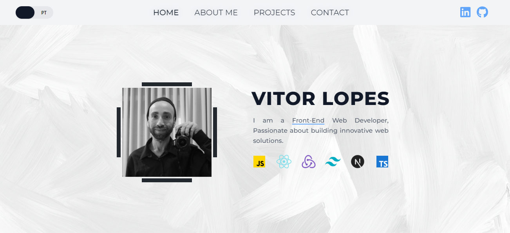

# Vitor Lopes's Personal Portfolio

Welcome to my personal portfolio, a showcase of my skills, projects, and interests, crafted using React and Tailwind CSS. This portfolio is not just a collection of my work but also a testament to my journey as a developer.

## Features

- **Bilingual Interface**: The portfolio offers a translation feature with support for English and Portuguese, making it accessible to a wider audience.
- **Project Showcase**: A slider photo carousel highlights the media from my key projects, giving visitors a visual taste of my capabilities.
- **Live Demonstrations**: Each project includes links to view the live code on GitHub or visit the deployed version.
- **About Me Section**: Learn more about my professional journey, interests, and the technologies I work with.
- **Contact Page**: Easy access for anyone looking to get in touch or collaborate on future projects.

## Key Projects

- **Jamming**: A dynamic web application for creating and managing Spotify playlists using the Spotify API.
- **Reddit Minimal**: A minimalistic interface for browsing Reddit, focusing on user experience and streamlined content delivery.
- **Haute Couture**: A mock e-commerce clothing store, showcasing responsive design and interactive shopping features.
- **Herbal Bliss**: A website for a tea shop developed using Next.js and TypeScript, focusing on server-side rendering for enhanced performance and a user-friendly online experience.

## Technologies Used

- **React.js**: For building a dynamic and responsive user interface.
- **Tailwind CSS**: Utilized for its utility-first approach to styling, facilitating a unique and responsive design.
- **i18next**: For implementing the bilingual functionality of the portfolio.
- **React Router**: To manage and navigate between different sections of the portfolio seamlessly.