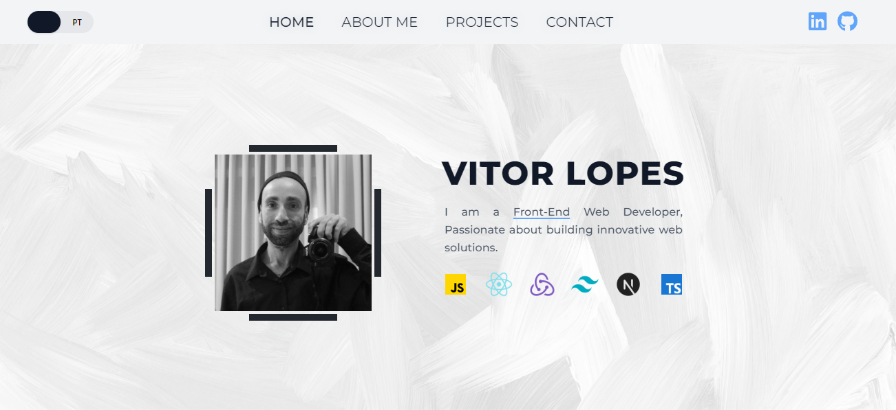

# Vitor Lopes's Personal Portfolio

> **Under Construction** - This portfolio is actively being updated with new projects and features.

Welcome to my personal portfolio, a showcase of my skills, projects, and interests, crafted using Next.js 15 and Tailwind CSS. This portfolio is not just a collection of my work but also a testament to my journey as a developer.

## Features

- **Bilingual Interface**: The portfolio offers a translation feature with support for English and Portuguese, making it accessible to a wider audience.
- **Project Showcase**: A slider photo carousel highlights the media from my key projects, giving visitors a visual taste of my capabilities.
- **Live Demonstrations**: Each project includes links to view the live code on GitHub or visit the deployed version.
- **About Me Section**: Learn more about my professional journey, interests, and the technologies I work with.
- **Contact Page**: Easy access for anyone looking to get in touch or collaborate on future projects.

## Key Projects

- **Rust Gambling**: A full-stack gambling platform built with Next.js, TypeScript, Node.js, and PostgreSQL.
- **Agro Efficace**: An agricultural management application developed with Next.js, TypeScript, PostgreSQL, and Tailwind CSS.
- **Chegando**: A native iOS application built with Swift, SwiftUI, MapKit, and CoreLocation for location-based services.

## Technologies Used

- **Next.js 15**: For building a dynamic and responsive user interface with the App Router.
- **Tailwind CSS**: Utilized for its utility-first approach to styling, facilitating a unique and responsive design.
- **Server Components**: Leveraging React Server Components for optimal performance.
- **TypeScript**: For type-safe development.
